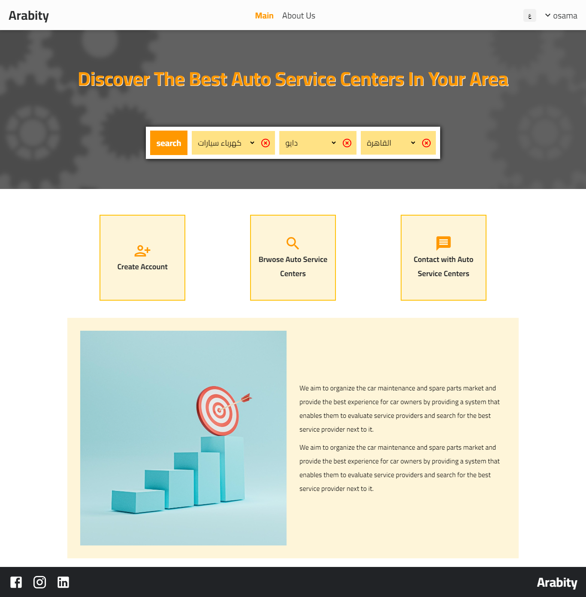
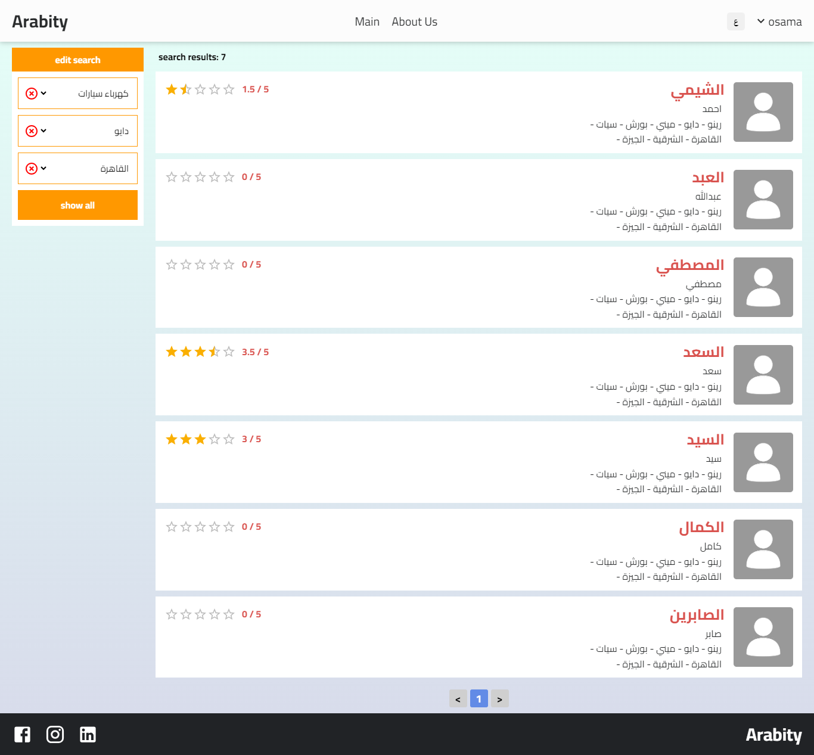
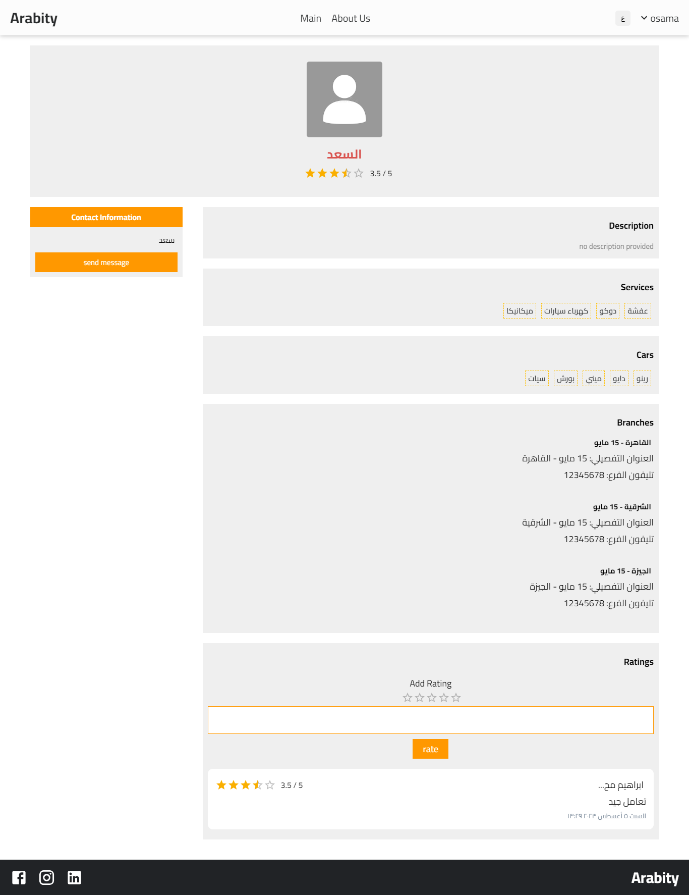
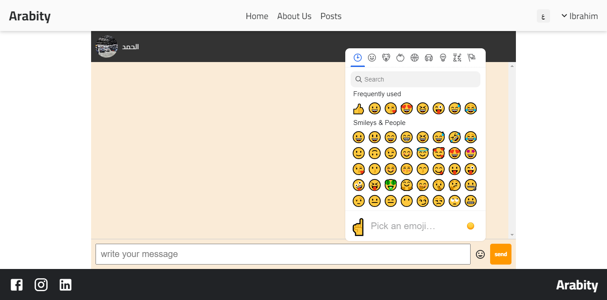
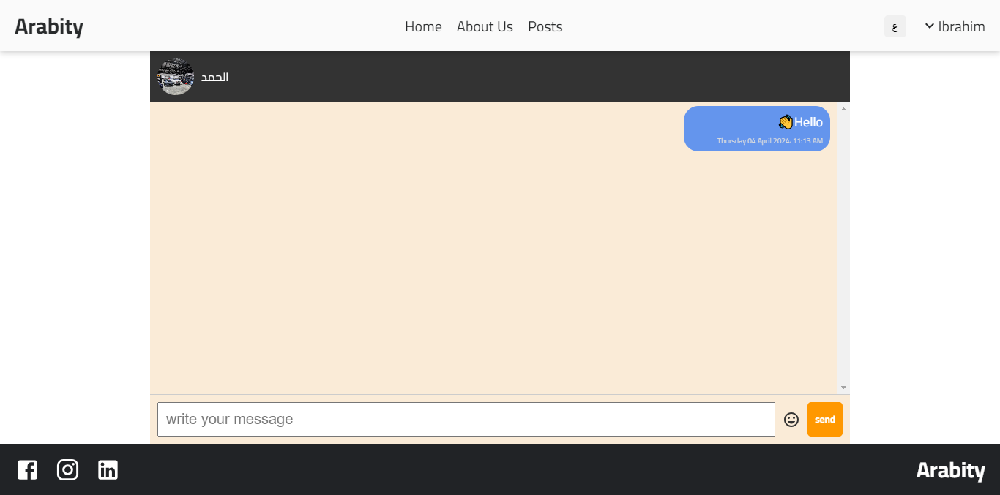
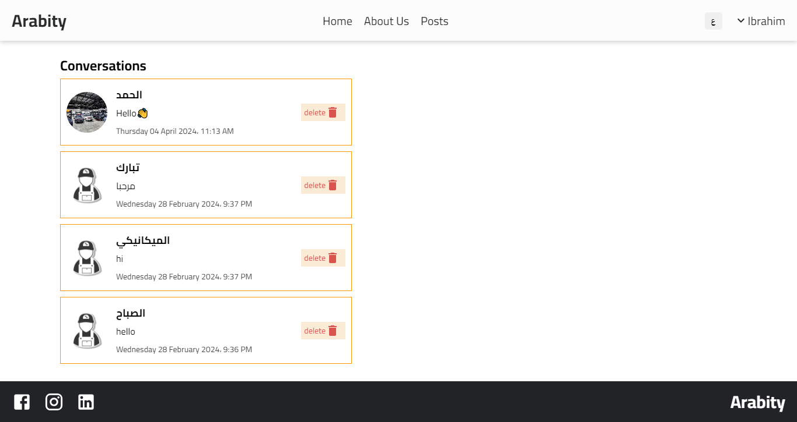

# Arabity

Arabity is designed to connect car owners with qualified mechanics in their area. Whether you need routine maintenance, or repairs, our platform makes it easy to find a reputable mechanic who can get the job done.

[Demo - Visit Now](https://arabity-fzmr.onrender.com) 🚀

## 🖥️ Tech Stack

**Frontend:**

&nbsp;
&nbsp;
&nbsp;
&nbsp;

**Backend:**

&nbsp;
&nbsp;
&nbsp;
&nbsp;

**Realtime Communication:**

**Deployed On:**

## 🚀 Features

- ✅ Login/Signup User/Mechanic Account
- ✅ Update Profile/Password User Account
- ✅ Search Mechanic Accounts by Province, Car Model, and Service Type
- ✅ Results Pagination
- ✅ View Mechanic Profiles
- ✅ Rate on Mechanic
- ✅ User/Mechanic Post & Comment feature
- ✅ Real Time User-to-Mechanic Chat
- ✅ Multilingual (Arabic/English)
- ✅ Emoji Enabled (Emoji Mart)

## ⌛ Upcoming Features

- 🚧 Follow a Mechanic
- 🚧 User Notfications
- 🚧 Search Results Sorting
- 🚧 Search By City After Selecting Province
- 🚧 Admin Dashboard
- 🚧 Reset Password Mail using Nodemailer

## Sneak Peek of Website Pages ✨:

<table>
  <tr>
    <td></td>
    <td></td>
  </tr>
  <tr>
    <td></td>
    <td></td>
  </tr>
  <tr>
    <td></td>
  </tr>
</table>

<h2>📬 Contact</h2>

If you want to contact me, you can reach me through below handles.

© 2023 Ibrahim Mohamed
